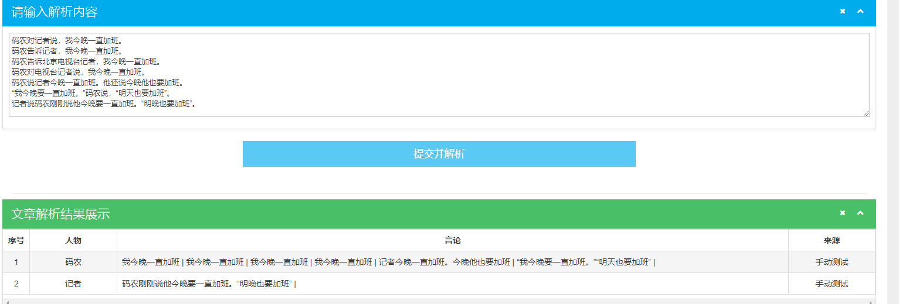

# AI-for-NLP-project01-Speech-Extraction-from-News

## 一、项目概述

**1.业务描述**  
项目主要前台使用Flask+Bootstrap+d3+mysql，后端使用的算法模型搭建工具包括了结巴分词、哈工大pyltp语言模型,对输入新闻进行人物言论提取。同时使用了scrapy+mysql+redis实现增量去重采集人民网、新华网新闻数据，提供新闻中的关键词数据完成词云功能展示、知识图谱展示。

## 二、项目主要功能描述

**1.新闻言论提取**  
+ 输入：通过前端页面输入新闻内容，并通过ajax提交中api.py文件中的parse_sentence()函数进行处理  
+ 处理：parse_sentence()主要调用controller/Model.py文件中的模块进行处理，并调用mysql数据库进行数据操作(select、insert)  
+ 输出：由parse_sententce()返回数据，由前端ajax接收数据  
**2.词云展示**  
+ 输入：无  
+ 处理：time.py主要为定时任务，每天24点自动执行一次update_wordcloud_img()。  
+ 输出：前端页面index.html中img标签直接调用‘/static/images/word_cloud.png’路径展示图片。  
**3.知识图谱展示** (<a style='color:yellow'> *TODO* </a>)   
+ 每条新闻采集5条关键词，查询所有关键词展示成知识图谱的形式  
+ 输入：无  
+ 处理：有前台ajax请求，api.py中的knowlege_graph()负责查询mysql中的数据进行处理
+ 输出：knowlege_graph()返回数据，ajax接收数据，d3模块(index.html中draw函数)进行数据展示  
**4.新闻采集(后台)**  (<a style='color:yellow'>*TODO*</a>)
+ 输入：根据规律整理好人民网、新华网的列表类网址，通过网址向下采集详情页，文件位于/news_spider/start_urls.py中  
+ 处理：调用scrapy框架采集新闻数据里，同时此新闻采集为定时功能，每次进行新的采集，从mysql中查询采集过的url，在redis中进行缓存，防止重复采集  
+ 输出：采集完成的新闻数据，存储在mysql中的news表中  
**5.定时任务(timer.py)** (<a style='color:yellow'>*TODO*</a>) 
+ word_sim()：对采集后的新闻进行处理并存储到mysql中的word_sim表中。主要存储内容包括：人物言论(name_says)、新闻中关键字(name_entity)、新闻链接(url)、所属栏目(category)、新闻内容(content)、says_entity(废弃未使用)  
+ update_wordcloud_img()：如前述，主要更新词云图片  
**6.算法模型(Model.py)**  
+ sentence_process(sentence):输入文章，对文章分段、分句，由valid_sentences(sentence_list)进一步处理，返回人物及言论
+ valid_sentences(sentence_list)：对单个段落进行处理并返回人物言论，内部使用sentence_embedding进行相邻句子关联，主要涉及了项目指导中的Stanford相邻句子关联度的论文，使用皮尔斯系数(pearsonSimilar(inA,inB))进行相似度判断。单个句子进一步由single_sentence(sentence,just_name,ws)处理。
+ single_sentence(sentence,just_name,ws)：提取单个句子人物及言论。**但是言论内部的言论未提取，例如：新华社报道，习大大表示XXXXXX。**  
**7.其他**
+ 其中说近似词提取以及语言模型训练工作在/app/controller/Pretreatment.py中生成，**说的近似词提取为老师课堂模板，未进行优化**。

## 三、项目部署

项目部署至Ubuntu参考地址：https://www.digitalocean.com/community/tutorials/how-to-serve-flask-applications-with-uswgi-and-nginx-on-ubuntu-18-04

项目启动文件wsgi.py中from run import app,在测试过程中无法正常使用，按照网上意见改成from run imort app as application,同时下方的app.run()改成application.run

ltp模型为哈工大的语言模型，model自己训练模型。训练方法在/app/controller/Pretreatment.py中，分别使用ltp与model文件夹分别放在与run.py同级目录

## 四、更新记录

#### 2019-05-27: **5月27日更新: (杨奕康)**
* 算法优化 ：

    0. **假设**: 
        * 假设发言人和相关言论出现在同一段落。
        * 代词所指的发言人出现在上文，假设为是上一个发言人。
        * 引号包裹部分若有标点符号，则判定该部分为言论(其余引号会被提前转为‘"’)。
    
    1. **句段预处理** ：以引号(“”)，句号(。)，感叹号(!)，问号(？)为基准对句子进行分割获得片段，
        * 在引号包含的范围内不进行分割，则不对其进行分割。
        * 仅当右引号(”)左边紧邻句号时，即(。”)才对右引号进行分割。
        * 引号内不含别的标点，依照假设该引号包裹区域部分不为言论，将('”')替换为('"')。
        
    2. **分析句式结构** 获得句子后，依照预设的特征将原句进行分割，确定*发言人所在句段*以及*言论所在句段*。<a style='color:red'> 注：发言人所在句段经常同时存在“发言人”和“言论”。 </a>
        * 若句子片段是左引号(“)开头，则假定该片段为主语后置的**直接引用**，判定没有被引号包裹部分为发言人所在句段，引号包裹部分为言论。
        * 其余句式皆暂时按做*发言人所在句段*处理。
    3. **信息抽取** 通过**依存分析**来解析句段结构。以“说”(或其他预设动词)为界，对左搜寻‘发言人’，对右搜寻‘言论’的起始点。
        * 根据named-entity向左找到第一个(ns, ni)并且对应relation为'SBV'且指向已知的动词(“说”)。
        * 向右找到第一个'SBV'或者非'VOB'节点，中间遇到指向宾语的定语可以直接将指针跳到关联末端以达到加速搜索目的。
        * 若找不到跟‘说’相关的信号动词，则将该句视为 ‘言论’。
    4. **言论合并** 获得检索结果后，基于**句子向量**来分析是否应将该言论与其余言论合并。
        * 若‘发言人’为空，比较当前言论与上一言论相似度，高于阈值则与上一段言论合并。
        * 若‘发言人’为代词，则同上。(<a style='color:yellow'>存在争议</a>)
        * 若‘发言人’与‘言论’都不为空，则将其存储。

* 典型案例特征：
    经过我们实验总结的几个典型特征，以及样式效果。```
    码农对记者说，我今晚一直加班。  // 主谓 
    码农告诉记者，我今晚一直加班。  // 主谓宾
    码农告诉北京电视台记者，我今晚一直加班。 // 主谓定定宾
    码农对电视台记者说，我今晚一直加班。    // 主谓
    码农说记者今晚一直加班。他还说今晚他也要加班。 // 主谓主
    “我今晚要一直加班。”码农说，“明天也要加班”。  // “...” 主谓 “...”
    记者说码农刚刚说他今晚要一直加班。“明晚也要加班”。 //主谓 主谓宾 “” 
    ```
    ** output **
    
* 后续调整：
    1. 代词部分假设不够严谨，因为代词并不一定指的是上一发言人，也有可能是上文提到的人或机构。
    2. 句子十分依赖标点符号作为特征，若是遇到标点不严谨的文段，程序不会运行。
    3. 代码中函数部分重合功能太多，重复计算较多

#### 2019-06-05: **6月5日更新: (杨奕康)**
* 算法速度优化：
    * 优化`Model.py`内`get_count()`算法复杂度，统一在`__init__()`中加载ltp_model，避免重复加载。
    * 清理`Model.py`中无用API。
    * 将模型加载转移到`__init__.py`主线程中初始化。
* 优化效果显著，效率平均提升6~7倍 （12s -> 1.5s），这个结果也基本符合理论上的复杂度优化。

## 五、经验教训

+ **哈工大语言模型安装：** 尝试用python3.7版本安装未成功，后来发现平台最高支持3.6版本。  
安装过程：https://blog.csdn.net/laoyaotask/article/details/45312905 (原文出处找不到了)
+ **哈工大与jieba分词进行比较：** 在Model.py文件中使用jieba_compare_pyltp()临时函数对两个工具交叉功能进行比较，发现pyltp分词效果好于jieba，但缺点是执行效率慢。
+ **算法模型执行速度慢：** 在打印每个函数执行时间的过程中发现get_count()函数执行次数非常多，它主要为实现Stanford的句子相似度算法，计算句子中每个词语的词频及词向量，每篇文章都要重复调用几十次以上。同时，发现哈工大的分词工具pyltp.segment执行每次在3秒以上，相当耗时。
+ **普林斯顿语句近似度算法:** 按照论文算法只完成了Vs=1/|s|*∑a/(a+p(w))*Vw，**后半部分的矩阵运算不知道该用如何工具去运算**。
+ **其他：** 在项目开发过程中，加了一些功能点在上面，导致了项目最后头重脚轻，前端后台的工作做了很多，但是算法模型部分没有得到很好的完善。甚至在开发的过程中已经记不清当初要做一个什么东西，做这个东西的目的是什么，只是觉得该加就加上去了。这在项目管理中是不允许的，应事先确定好需求和计划，然后再去执行，等到基本需要功能完成后再去进行扩展。